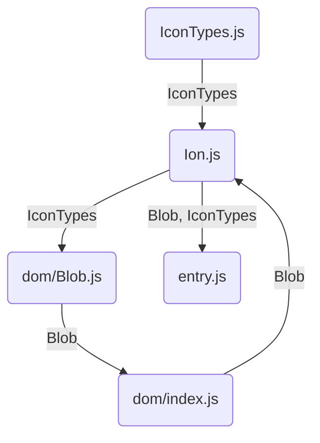

## context

- https://github.com/vitejs/vite/issues/14048#issuecomment-2354774156

## module graph



## tests

```sh
# node
$ node src/entry.js
{
  "IonTypes": {
    "BLOB": "Blob"
  },
  "dom": {
    "Blob": "Blob"
  }
}

# webpack
$ pnpm build-webpack
$ node dist-webpack/entry.js
{
  "IonTypes": {
    "BLOB": "Blob"
  },
  "dom": {
    "Blob": "Blob"
  }
}

# vite ssr
$ node ./vite-ssr.js
/xxx/src/ion-js/dom/Blob.js:5
const Blob = __vite_ssr_import_0__.IonTypes.BLOB;
                                            ^

TypeError: Cannot read properties of undefined (reading 'BLOB')
```

## notes

Webpack's module factory has exports definition first `__webpack_require__.d(...)`, which is then followed by `__webpack_require__(...)`.
This is necessary for cyclic imports to be handled similar to Node.

For example, `./src/ion-js/Ion.js` has the following module factory. If `__webpack_require__.d` were to come after `__webpack_require__("./src/ion-js/dom/index.js")`,
it would cause a similar error as Vite SSR.

```js
"./src/ion-js/Ion.js": () => {
  __webpack_require__.r(__webpack_exports__);
  __webpack_require__.d(__webpack_exports__, {
    IonTypes: () => (_IonTypes_js__WEBPACK_IMPORTED_MODULE_0__.IonTypes),
    dom: () => (_dom_index_js__WEBPACK_IMPORTED_MODULE_1__)
  });
  var _IonTypes_js__WEBPACK_IMPORTED_MODULE_0__ = __webpack_require__("./src/ion-js/IonTypes.js");
  var _dom_index_js__WEBPACK_IMPORTED_MODULE_1__ = __webpack_require__("./src/ion-js/dom/index.js");
};
```
