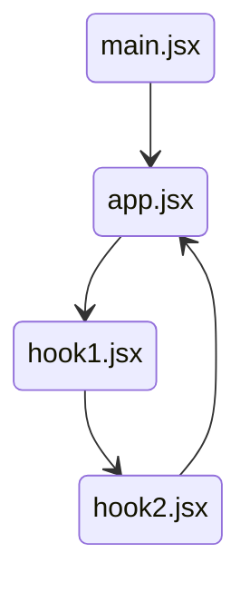

- https://github.com/vitejs/vite/issues/18217

This reproduction includes a following circular import



Reproduction steps:

```sh
# start server and also open browser devtool
pnpm dev --debug hmr

# run in another terminal
while sleep 1; do touch src/repro/hook2.jsx; done
```

For each change of `hook2.jsx`, Vite logs this in the terminal:

```
  vite:hmr [file change] src/repro/hook2.jsx +4s
  vite:hmr circular imports detected: /src/repro/hook2.jsx -> /src/repro/app.jsx -> /src/repro/hook1.jsx -> /src/repro/hook2.jsx +0ms
4:05:30 PM [vite] hmr update /src/repro/hook1.jsx
4:05:30 PM [vite] hmr invalidate /src/repro/hook1.jsx Could not Fast Refresh. Learn more at https://github.com/vitejs/vite-plugin-react/tree/main/packages/plugin-react#consistent-components-exports
  vite:hmr circular imports detected: /src/repro/app.jsx -> /src/repro/hook1.jsx -> /src/repro/hook2.jsx -> /src/repro/app.jsx +25ms
4:05:30 PM [vite] hmr update /src/repro/app.jsx
```

and browser devtool console should show 3 lines:

```
🔵 1727601694031 [import:hook2.jsx]
🔶 1727601694049 [useHook2]
🔶 1727601694049 [useHook2]
```

Occasionally, it logs only a single `🔵 1727601694031 [import:hook2.jsx]` line, which means Vite HMR is importing a new file,
but React fast refresh is not re-rendering properly.
